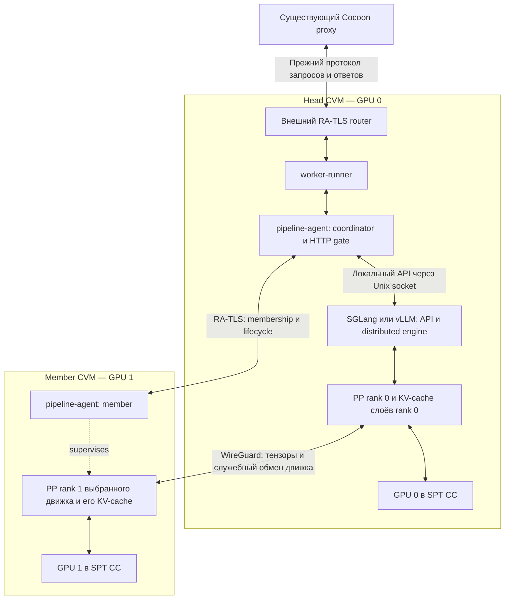

# Один Cocoon worker с pipeline между confidential VM

Дата: 2026-10-04. Статус: технический дизайн первой версии, до проверки на GPU.
Основание: текущий checkout Cocoon, HEAD `b68c0f0`, включая имеющиеся локальные файлы.

Документ описывает один логический Cocoon worker с несколькими внутренними стадиями вычислений. Названия новых компонентов и конфигураций ниже предлагаемые. Существующие возможности подтверждены чтением кода; совместимость SGLang/vLLM и NCCL с выбранным режимом CC и производительность ещё не проверены экспериментально.

## 1. Решение и границы

**Весь pipeline — один Cocoon worker.** У него одна внешняя модель, один коэффициент цены, один общий лимит запросов и существующие расчёты с proxy. Ступени — внутренние процессы распределённого inference backend. Они не регистрируются в Cocoon, не получают запросы от proxy и не имеют отдельных платёжных каналов.

Один владелец объединяет несколько confidential VM, каждой передаётся ровно одна GPU в Single GPU Passthrough CC. VM могут находиться на одном сервере с несколькими GPU или на нескольких машинах владельца, соединённых локальной сетью. Первая VM одновременно содержит внешний `worker-runner`, координатор группы и первую ступень. Остальные содержат внутренний агент и следующие ступени. Вариант с несколькими CVM на одном сервере соответствует описанному NVIDIA размещению [в SPT CC](https://docs.nvidia.com/595trd1-trusted-computing-solutions-release-notes.pdf), раздел Single GPU Passthrough; межсерверный вариант требует проверки каждой платформы и сетевого пути.

Размещение задаётся конфигурацией и deployment tooling. В обоих вариантах используется один и тот же guest-код и образ для соответствующего security/backend profile; перенос member на другой сервер не требует отдельной реализации pipeline. Сам образ и код worker для этой фичи дорабатываются — речь не об использовании нынешней VM без изменений.

В первой версии:

- Production profile: Intel TDX, две одинаковые GPU из поддерживаемой SPT CC конфигурации; все VM одного проверенного релиза. Структура допускает N ступеней, но N > 2 и AMD SEV-SNP требуют отдельных испытаний.
- Один фиксированный набор участников на время работы группы, одна dense text model с поддержкой PP в выбранном релизе **SGLang или vLLM**. Backend и версия едины для всей группы; смешивание движков между стадиями не поддерживается.
- Выбранный движок отвечает за слои, KV-cache, scheduling, batching, sampling и полный цикл генерации. Cocoon управляет жизненным циклом и границей доверия группы через отдельные backend adapters.
- `tensor_parallel_size = 1`, `pipeline_parallel_size = N`, `data_parallel_size = 1`.
- В production — взаимная аттестация VM и WireGuard внутри каждой CVM. RA-TLS аутентифицирует участников и обмен публичными network keys; WireGuard шифрует межузловой трафик движка. Открытые prompts, активации и KV-cache остаются внутри доверенных VM/GPU.
- Сбой любой ступени завершает текущие запросы ошибкой и приводит к пересозданию всей группы исполнения. Продолжение генерации после такого сбоя отсутствует.

Не входят: сборка pipeline из разных владельцев, поиск ступеней через proxy, выплаты по ступеням, собственная пересылка тензоров через координатор Cocoon, динамическое переразбиение модели, перенос KV-cache, горячая замена rank, speculative decoding, MoE/мультимодальные модели, WAN discovery/NAT traversal, разработка аппаратного multi-GPU CC.

Цель — запуск модели и рабочего контекста, которые не помещаются на одной GPU. Ускорение одного ответа не является обещанием. GPU без CC пригодны для функционального стенда, но это разбиение не придаёт им аппаратную конфиденциальность.

Разработка начинается на доступном оборудовании:

| Среда | Назначение | Что не подтверждает |
|---|---|---|
| Один Mac, локальные процессы | Логика группы, gate, ошибки и интеграция Cocoon с симулятором backend | Linux networking, CUDA/NCCL, аппаратная аттестация |
| Linux VM на Mac | WireGuard, namespaces, firewall и lifecycle сервисов | Производительность NVIDIA и CC |
| Две машины, на каждой RTX 4000 SFF Ada Generation 20 GB, LAN | Настоящие SGLang/vLLM PP=2 через WireGuard, capacity, производительность и отказы | TDX/GPU CC, его совместимость и накладные расходы |
| Две CVM с поддерживаемыми CC GPU | Проверка production trust chain и полного вычислительного пути | Другие модели/релизы/платформы без испытаний |

Функциональный MVP без CC разрешает продолжать разработку; выпуск confidential worker требует отдельного прохождения CC-проверок из раздела 15.

## 2. Как существующие компоненты участвуют в решении

| Компонент | Что есть сейчас | Использование в новом дизайне |
|---|---|---|
| [ClientRunner](/Users/ms/Developer/cocoon/runners/client/ClientRunner.cpp), ClientRunningRequest | Клиентский HTTP API, запросы и поток ответа через proxy | Без нового pipeline API |
| [ProxyInboundWorkerConnection](/Users/ms/Developer/cocoon/runners/proxy/ProxyInboundWorkerConnection.cpp:33) | Проверка worker image/model, регистрация owner, модели, цены и capacity | Регистрирует только головной worker |
| [ProxyRunner](/Users/ms/Developer/cocoon/runners/proxy/ProxyRunner.cpp:1428) | Выбирает доступное соединение по модели, цене, нагрузке; исключает disabled | Видит одну полную модель; алгоритм выбора сохраняется |
| [ProxyRunningRequest](/Users/ms/Developer/cocoon/runners/proxy/ProxyRunningRequest.cpp:18) | Передаёт целый запрос, пересылает ответы, имеет deadline | Не управляет ступенями и не видит их тензоры |
| [WorkerRunner](/Users/ms/Developer/cocoon/runners/worker/WorkerRunner.cpp:56) | Общий admission по `max_active_requests`, запуск HTTP-запроса в backend | Работает только в head VM; получает готовность всей группы |
| [WorkerProxyConnection](/Users/ms/Developer/cocoon/runners/worker/WorkerProxyConnection.cpp:26) | Handshake, сверка платежей, состояние enabled/disabled | Используется без изменения сетевого контракта |
| [WorkerUplinkMonitor](/Users/ms/Developer/cocoon/runners/worker/WorkerUplinkMonitor.cpp:15) | Проверяет только HTTP 200 на `/v1/models` | Получает этот ответ от локального gate, учитывающего все ranks |
| [WorkerRunningRequest](/Users/ms/Developer/cocoon/runners/worker/WorkerRunningRequest.cpp) | Валидация/дешифрование, HTTP forwarding, postprocessing и usage; ошибки и локальная отмена реализованы шагами 3–4 | В шаге 9 подключается к gate группы |
| [AnswerPostprocessor](/Users/ms/Developer/cocoon/runners/helpers/ValidateRequest.cpp:1409) | SSE/JSON, usage и шифрование ответа | Работает один раз над полным ответом модели |
| [HTTP client](/Users/ms/Developer/cocoon/boost-http/http-client.cpp) | Асинхронное чтение backend, отдельный error callback, cancel handle и абсолютный deadline | Лимиты памяти/backpressure остаются в шаге 5 |
| [TL API](/Users/ms/Developer/cocoon/tl/generate/scheme/cocoon_api.tl:186) | `worker.params`, `worker.enabledDisabled`, `proxy.runQueryEx`, final usage | Внешние сообщения остаются прежними |
| [Worker/Proxy contracts](/Users/ms/Developer/cocoon/runners/smartcontracts/WorkerContract.cpp), [расчёты proxy](/Users/ms/Developer/cocoon/runners/proxy/ProxyRunner.cpp:1553) | Расчёт за логический запрос и owner | Одна выплата за полный inference, без умножения на N |
| [RootContractConfig](/Users/ms/Developer/cocoon/runners/smartcontracts/RootContractConfig.hpp) | Разрешённые worker images и модели | Обычное добавление нового worker image; новый тип контракта не нужен |
| [KeyManagerRunner](/Users/ms/Developer/cocoon/runners/key-manager/KeyManagerRunner.cpp:275) | Выдача ключей доверенным ролям | Существующий путь сохраняется; ключи платежей/клиентского шифрования не раздаются ступеням |
| [router](/Users/ms/Developer/cocoon/tee/cocoon/router.cpp), [RATLS](/Users/ms/Developer/cocoon/tee/cocoon/RATLS.cpp) | Аттестация и шифрование внешнего соединения | Внешний router сохраняется; библиотека RA-TLS используется для внутреннего управления |
| [spec-worker](/Users/ms/Developer/cocoon/spec/spec-worker/init) | dm-verity mount модели, runtime rendering, запуск backend/worker/router | Отдельная специализация для pipeline, общий measured spec для head и members |
| [SGLang service](/Users/ms/Developer/cocoon/spec/spec-worker/cocoon-sglang.service), [vLLM service](/Users/ms/Developer/cocoon/spec/spec-worker/cocoon-vllm.service) | В init выбран SGLang, image `v0.5.10.post1-cu130-runtime` закреплён digest; vLLM использует `latest` | Два backend adapters и отдельные проверенные pipeline profiles с immutable digests |
| [GPU attestation](/Users/ms/Developer/cocoon/reprodebian/gpu_attest/gpu_attest.py), [ready target](/Users/ms/Developer/cocoon/reprodebian/cocoon-init/cocoon-ready.target) | Проверка GPU и зависимость запуска spec от готовности | Выполняется в каждой VM; агент дополнительно проверяет наличие одной GPU и успешную проверку |
| [cocoon-launch](/Users/ms/Developer/cocoon/scripts/cocoon-launch:586), [build-model](/Users/ms/Developer/cocoon/scripts/build-model) | Одна VM/GPU; общий read-only model archive; QEMU user networking | Групповой запуск N VM, отдельные ресурсы и сеть; архив модели переиспользуется |
| [health-monitor](/Users/ms/Developer/cocoon/tee/cocoon/health-monitor.cpp) | Метрики процессов и VM | Дополняется состоянием всей группы и агрегированными метриками |
| [CPU experiment](/Users/ms/Developer/cocoon/experiments/smollm_pipeline/README.md) | Проверка математического разреза PyTorch модели | Остаётся экспериментом; не становится production backend и не доказывает GPU CC совместимость |
| [Локальный запуск](/Users/ms/Developer/cocoon/docs/deployment.md:80), [smoke test](/Users/ms/Developer/cocoon/benchmark/smoke-local.py) | `--local-all`, fake-TON, подменяемый HTTP backend | Основа быстрого dev-стенда; orchestration двух pipeline agents и симулятор ещё нужно добавить |

Документация в `docs/` местами описывает прежние пути файлов и более сильные свойства, чем следует из текущей реализации. Для решений выше приоритет имеет исполняемый код.

## 3. Архитектура исполнения



Головная VM исполняет часть модели, поэтому отдельная GPU для координатора не нужна. CVM на схеме могут находиться на одном или разных физических серверах. Нагрузку API, токенизации и сетевого шифрования учитываем при выделении CPU/RAM head VM. Способ предоставления локального API зависит от adapter, см. раздел 7.

`pipeline-agent` — новый небольшой сервис в каждой VM. В head он координирует состав группы и предоставляет локальный HTTP gate. В member он проверяет предложение группы, настраивает сеть, через backend adapter запускает локальный rank и сообщает состояние. Предпочтительна реализация с переиспользованием C++ RA-TLS/actor-инфраструктуры Cocoon. Математика и scheduler остаются в выбранном движке.

Агент не получает команд «вычисли токен» и не сериализует hidden states. Его протокол обслуживает запуск и остановку фиксированного распределённого процесса. Тензоры и метаданные передаются штатным транспортом движка через overlay; дополнительный tensor relay в head не создаётся.

## 4. Внешняя совместимость и proxy

Для proxy worker объявляет:

- `model`: прежний полный идентификатор `name@commit:verity_hash`;
- `worker_owner_address`: одного владельца всей группы;
- `coefficient`: цену полного inference;
- `max_active_requests`: суммарный лимит группы;
- прежние версии внешнего протокола;
- при необходимости описательные `pipeline_size` и `backend` в существующем `machine_description_json`. Эти поля не являются доказательством конфигурации.

Одна группа может иметь несколько существующих соединений с proxy; это не несколько работников по числу GPU. Admission внутри head остаётся общим для всех соединений. Для первого стенда достаточно одного proxy connection.

Сохранение proxy требует также прежнего пользовательского контракта модели: допустимых context/output limits, формата ответа и поддерживаемых text features. Proxy не выбирает worker по `max_model_len` или capabilities из `machine_description_json`. Поэтому под тем же model identifier нельзя незаметно выставить несовместимый профиль с существенно меньшим контекстом или потерянными API-возможностями. Первый профиль должен удовлетворять принятому контракту выбранной модели; иначе его нельзя выпускать под этим identifier без отдельного решения о маршрутизации. Превышение разрешённых лимитов возвращает явную validation error до генерации, без тихой обрезки prompt/output.

**Изменения алгоритма proxy и внешней TL-схемы для этой архитектуры не требуются.** Нужны обычная регистрация нового разрешённого worker image в root config и, если модель новая, её существующего model identifier. Независимая аттестация всех ступеней самим proxy в v1 не вводится: proxy доверяет разрешённому head image, который обязан проверять всю группу.

Существующий encrypted-request путь сохраняется: head выполняет нынешнее дешифрование и обработку ответа. Это не новая гарантия end-to-end secrecy от кода proxy: текущие proxy/key-manager участвуют в существующей схеме ключей. Новое свойство здесь — отсутствие промежуточных активаций на внешнем proxy.

На обычном запросе:

1. Proxy выбирает head как обычный worker и передаёт `proxy.runQueryEx`.
2. `WorkerRunner` проверяет disabled/capacity; `WorkerRunningRequest` валидирует запрос и при необходимости дешифрует его.
3. Локальный gate принимает запрос только в `READY` и закрепляет за текущим `epoch` группы.
4. Выбранный backend исполняет prefill и все decode steps. KV-cache каждой части остаётся в соответствующей VM/GPU. Все необходимые внутренние сообщения проходят внутри защищённой группы.
5. Через gate возвращается один OpenAI-compatible JSON/SSE ответ. Cocoon postprocessing выполняется один раз; proxy получает прежние answer/final-info сообщения.

## 5. Конфигурация и проверка модели

Разделяем три вида данных:

| Данные | Где задаются | Как доверяем |
|---|---|---|
| Режим безопасности, разрешённые adapters/backend digests, параметры и capabilities | Measured `spec-pipeline-worker` и VM image | Через текущую аттестацию образа |
| Выбор разрешённого backend/model profile, PP size, limits и placement | Runtime config оператора | Проверяем в attested code; общие параметры сравниваем между ranks, адреса связываем с roster |
| Session keys, `boot_id`, `epoch`, roster | Создаются внутри VM | Передаются только через аттестованный канал, не принимаются как доверенные данные хоста |

В существующем [prepare-spec](/Users/ms/Developer/cocoon/reprodebian/cocoon-init/cocoon-prepare-spec) каталог `runtime/` исключён из измерения. Поэтому помещение `backend_digest` или списка доверенных peers в runtime само по себе не делает их допустимыми. Runtime выбирает только разрешённый measured profile; он не может задавать произвольный Python-код, Docker tag, plugin, команду запуска или отключать шифрование/аттестацию.

Предлагаемый операторский конфиг, не текущий синтаксис `cocoon-launch`:

```ini
[node]
type = pipeline-worker
model = <approved-name>@<commit>:<verity-hash>
owner_address = <owner>
node_wallet_key = <existing-worker-wallet-key>
profile = sglang-dense-pp2-cc-v1
instance = 0

[rank.0]
role = head
host = machine-a
gpu = 0000:01:00.0
control_endpoint = <head-reachable-address>:12310
wireguard_endpoint = <head-reachable-address>:51820

[rank.1]
role = member
host = machine-b
gpu = 0000:01:00.0
control_endpoint = <member-reachable-address>:12310
wireguard_endpoint = <member-reachable-address>:51820

[resources]
head_vcpus = <from-pilot>
member_vcpus = <from-pilot>
ram_gib_per_vm = <from-pilot>
max_active_requests = <bounded-by-profile>
```

Вариант на одном сервере задаёт одинаковый `host`, разные GPU и уникальные VM endpoints. PCI BDF уникален в пределах хоста, поэтому одинаковые BDF на разных машинах допустимы. `host` выбирает deployment target, а не автоматически разрешает произвольное удалённое исполнение; для v1 достаточно генерировать bundle и явно запускать его на каждой машине.

Wallet key передаётся только head. Порты, addresses и PCI BDF — сведения о размещении, не удостоверения доверия. Underlay endpoints должны быть двусторонне достижимы для control TCP и WireGuard UDP; overlay IP назначает агент и включает в roster. Смена размещения или backend требует нового epoch.

Агент строит проверенное `effective_config`, содержащее как минимум:

```text
protocol_version, profile_id, security_mode, model_identifier, model_verity_root,
backend_kind, backend_oci_digest, adapter_version, runtime_compatibility_id,
pp_size, tp_size=1, dp_size=1, layer_partition,
dtype, quantization, tokenizer/chat-template identity,
max_model_len, max_num_seqs, max_num_batched_tokens,
gpu_memory_policy, prefix_cache_policy, validated_backend_options,
security_policy_version
```

`config_digest` вычисляется из канонического представления: фиксированная схема, нормализованные типы, без зависимости от порядка JSON-полей. Hash используется для сравнения; авторизацию дают measured policy и проверка модели, а не сам hash.

Названия лимитов в `effective_config` — канонические поля Cocoon, а не общий CLI обоих движков. Adapter переводит их в параметры своего backend и проверяет семантику. Несовместимый профиль отклоняется до запуска; его нельзя молча приблизить другим лимитом или переключить backend. `security_mode` определяется доверенным profile, а не свободным runtime-флагом отключения аттестации.

В production все VM монтируют **один и тот же полный model archive** через dm-verity и read-only mount. На одном хосте можно подключить один архив нескольким гостям; между серверами tooling заранее доставляет одинаковые архив и verity metadata. Гостевые page cache/RAM не считаем общими. Каждый backend загружает слои своего rank; пиковую CPU RAM при загрузке измеряем, не предполагаем деление полной RAM строго на N. Online загрузка недостающих весов при формировании группы не требуется.

Head проверяет разрешённый model identifier текущим root config. Каждый member проверяет совпадение `effective_config` со своим реально открытым dm-verity mapping и путём загрузки. Tokenizer, config, chat template и generation config входят в защищённый набор файлов. Произвольный `trust_remote_code` в первом профиле запрещён.

В v1 используем одинаковый measured spec и релиз во всех VM. Разница head/member задаётся проверенным runtime role. Политика внутренней RA-TLS требует тот же разрешённый image hash; это избегает циклического включения hash head в образ member и наоборот. Будущие разные образы/TEE требуют явно версионированной политики совместимости.

Равенство фактических measurements при выбранной VM-конфигурации проверяем на стенде. Если различия ресурсов/boot configuration меняют hash, первый профиль унифицирует такую конфигурацию; автоматически расширять allowlist по полученным от хоста значениям нельзя.

## 6. Аттестация группы и принадлежность соединений

Цепочка доверия:

```text
proxy проверяет head image
    → проверенный head agent допускает только проверенные members
        → каждый member проверяет свой GPU, модель и backend
            → ключи внутренней сети остаются в этих confidential VM
```

Проверки head image достаточно только потому, что его код не может принять клиентский inference до выполнения этой цепочки. Один валидный сертификат head не доказывает автоматически готовность его GPU или остальных VM.

Текущая [RA-TLS реализация](/Users/ms/Developer/cocoon/tee/cocoon/RATLS.cpp:55) связывает quote с публичным ключом TLS. GPU проверяется отдельно внутри VM. В v1 сохраняем этот принцип: проверенный агент сообщает результат boot/runtime проверок по аутентифицированному каналу. Не заявляем, что quote head содержит quotes всех GPU.

Внутренний control channel использует существующие RA-TLS primitives Cocoon. Production policy явно требует real TDX, допустимые collateral roots и непустой allowlist измерений. `any`, `fake_tee`, debug/devtools и пустой список разрешённых image hashes не являются production fallback. Наличие TLS без подходящего image hash недостаточно. Dev-стенды из раздела 15 используют отдельную тестовую политику/удостоверения; production peers их отвергают.

Предлагаемая последовательность формирования группы:

1. После готовности GPU и dm-verity каждый агент создаёт случайный `boot_id`. Для каждого нового epoch он создаёт новую WireGuard key pair в памяти guest. Самостоятельный `nvidia-smi` не заменяет успешную GPU attestation.
2. Head создаёт случайный 256-bit `epoch`. `group_id` связывает публичный ключ head, epoch и config digest. Это идентичность запуска, не blockchain worker identity.
3. Head соединяется с указанными endpoints по mutual RA-TLS. Обе стороны извлекают проверенный peer public key и image hash; повторно использовать простой флаг «TLS OK» без identity нельзя.
4. По этому же соединению идёт `Hello`: protocol version, свежие challenge nonces, role, boot_id, config digest, локальная GPU readiness, внутренний network public key. Агент формирует сведения из проверенного локального состояния, не пересылает runtime JSON как доказательство.
5. Head проверяет N уникальных участников и выдаёт каждому фиксированный rank. Один агент допускает только одну активную группу, один rank и один закреплённый head key. Повторение boot identity/rank/network key отклоняется. Если SDK даёт проверенную GPU identity, дополнительно исключаем её дублирование; произвольный NVML UUID не считаем криптографическим доказательством.
6. Head рассылает `PrepareGroup`: epoch, config digest, полный roster `rank → peer identity, boot_id, network key, overlay IP` и ограниченную lease. Member проверяет собственную запись и ответным `Prepared` подтверждает digest всего roster.
7. После всех подтверждений агенты устанавливают WireGuard peers только для этого roster. `CommitGroup` разрешает запуск выбранного backend через adapter. Клиентский gate ещё закрыт.
8. После старта всех ranks, engine health check и короткого synthetic warmup полного pipeline head переводит группу в `READY`.

Network public key привязывается к attested VM передачей через аутентифицированный control channel, без изменения формата существующих внешних сертификатов. Для этого агент обязан сам генерировать ключ и удерживать его private part; принять пару ключей от host launcher нельзя. Через RA-TLS передаются публичные ключи и управление группой; каждый WireGuard packet дополнительно в RA-TLS не оборачивается.

Для control channel используем отдельный certificate base `/etc/tee/pipeline`, созданный теми же `gen-cert-synced`/RA-TLS средствами и управляемый supervisor. Это необходимо, потому что существующий [cocoon-cert-refresh.timer](/Users/ms/Developer/cocoon/reprodebian/cocoon-init/cocoon-cert-refresh.timer) примерно раз в час вызывает генерацию с `--force` для `/etc/tee/tee`, меняя ключ. Внешний router продолжает свой нынешний refresh. Внутренняя pinned identity не меняется посреди epoch; её обновление согласовано с drain/restart группы.

Membership-сообщения имеют `epoch`, `config_digest`, `sequence` и request ID. Control protocol — отдельные ограниченные frames, например length-prefixed JSON до 64 KiB со строгой схемой, без pickle и без произвольных команд исполнения. Повтор одного и того же idempotent `Prepare/Commit/Stop` возвращает прежний результат; другой payload с тем же ID отвергается. Сообщения старого epoch не меняют новую группу.

Runtime endpoints могут быть перенаправлены злонамеренным хостом, поэтому адрес не доказывает принадлежность серверу. Перенаправление на неподходящий image/config отклоняется; на другой полностью подходящий attested member не раскрывает данные хосту. Этот дизайн не доказывает физическое совместное размещение или владение железом; один владелец и LAN — условия выбранного deployment profile.

## 7. Защищённый транспорт для SGLang и vLLM

Штатный distributed runtime не считаем доверенным сетевым периметром. vLLM документирует отсутствие авторизации и шифрования внутренних PyTorch connections: [security documentation](https://docs.vllm.ai/en/stable/usage/security/#notes-on-pytorch-distributed). SGLang также использует отдельные device/CPU groups для тензоров и метаданных: [parallel_state.py, v0.5.10.post1](https://github.com/sgl-project/sglang/blob/v0.5.10.post1/python/sglang/srt/distributed/parallel_state.py). Нельзя защитить только OpenAI API или один порт rendezvous: существуют дополнительные control/tensor sockets.

Для v1 выбран **WireGuard внутри каждой CVM, с публичными ключами, аутентифицированными через RA-TLS**. Движки видят обычную IP-сеть и используют штатный distributed transport. Это проектное решение; готовой интеграции в Cocoon нет, совместимость каждого profile проверяется отдельно.

У каждой VM две сетевые области:

- Guest underlay namespace: virtio NIC, RA-TLS agent/control, внешний Cocoon router в head, исходящие служебные соединения.
- `cocoon-pipeline` namespace: только `lo` и `wg0`, без незашифрованного интерфейса в сеть хоста. В нём работают выбранный backend и все его subprocesses.

WireGuard interface создаётся в underlay namespace и перемещается в engine namespace. Его UDP socket остаётся в исходном namespace, тогда как открытый трафик доступен только в engine namespace. Этот механизм описан [WireGuard](https://www.wireguard.com/netns/). При исчезновении `wg0` у engine нет альтернативного маршрута наружу.

Gate в head слушает `127.0.0.1:8000` в guest underlay, сохраняя текущий `forward_requests_to`. Его upstream — filesystem Unix socket `/run/cocoon-pipeline/backend.sock` внутри той же CVM:

- vLLM может слушать его непосредственно через [`--uds`](https://docs.vllm.ai/en/stable/cli/serve/#--uds).
- У рассматриваемого SGLang нет аналогичного CLI-параметра в [server_args.py](https://github.com/sgl-project/sglang/blob/v0.5.10.post1/python/sglang/srt/server_args.py). Поэтому SGLang API слушает `127.0.0.1:30000` **в engine namespace**, а небольшой доверенный helper в том же namespace предоставляет Unix socket и пересылает HTTP stream на этот фиксированный loopback endpoint. Helper включён в measured deployment, не принимает произвольный адрес назначения, сохраняет backpressure и закрывает upstream при отмене. Через него идут только пользовательские API-запросы/ответы, не межстадийные тензоры.

Filesystem socket доступен gate через явно заданный guest-local mount, с ограниченными правами. Он не находится в общем каталоге физического хоста. Между underlay и engine не добавляется открытый TCP-интерфейс; API не публикуется на `wg0` или через Docker `-p`.

Для engine:

- Rendezvous/master address и все объявляемые межузловые адреса указывают только overlay IP. Конкретные flags/env задаёт adapter: например, `VLLM_HOST_IP`/`--master-addr` для vLLM и `--dist-init-addr` для SGLang; autodetection проверяется в выбранном релизе.
- NCCL принудительно использует Socket transport; `NCCL_SOCKET_IFNAME` ограничен `wg0`, CPU/Gloo transport — также overlay.
- Меж-GPU P2P, shared-memory transport между VM, IB/RDMA и внешние network plugins исключены в первом профиле.
- Network namespace и device/container restrictions обеспечивают запрет обхода; одни environment variables не являются security boundary.
- Контейнеру не передаются underlay network, host Docker socket или полномочия менять namespace/routes. Все child processes наследуют engine namespace.

Для первичного эксперимента проверяем следующие environment values:

```text
NCCL_NET: Socket
NCCL_SOCKET_IFNAME: =wg0
GLOO_SOCKET_IFNAME: wg0
NCCL_P2P_DISABLE: 1
NCCL_IB_DISABLE: 1
NCCL_SHM_DISABLE: 1
```

Это стартовая конфигурация, не подтверждённый CC-рецепт: exact flags и allocator settings фиксируются по итогам испытания выбранных версий. [NCCL environment variables](https://docs.nvidia.com/deeplearning/nccl/user-guide/docs/env.html).

Для двух участников достаточно одной пары WireGuard peers. Для N > 2 конфигурация предусматривает прямую связность всех ranks: обмен движков не обязательно ограничен соседними PP stages. `AllowedIPs` связывает peer key с единственным выданным IP; произвольные маршруты из peer сообщения не устанавливаются. Подсети разных групп изолированы namespace. Внутренние TCP-порты движков не нужно открывать на физическом хосте.

На underlay разрешаются только внутренний RA-TLS control TCP и WireGuard UDP; конкретные порты фиксирует measured profile. Например, 12310/TCP и 51820/UDP — предлагаемые значения, сейчас в Cocoon их нет. На обеих сторонах остаётся гостевой firewall. Поддельные или переставленные пакеты хоста не дают доступа к открытому трафику.

Физический путь активаций:

```text
GPU A → защищённый SPT transfer → private RAM CVM A
      → WireGuard encryption внутри CVM A
      → virtio / недоверенные host bridge и, при разных хостах, LAN: ciphertext
      → WireGuard decryption внутри CVM B
      → private RAM CVM B → защищённый SPT transfer → GPU B
```

CPU staging здесь ожидаем, но его реализацию в NCCL и ограничения CUDA host allocations нужно проверить на CC-стенде в Gate E. Нельзя предполагать, что любой NCCL transport автоматически работает в SPT CC.

WireGuard — выбранный транспорт v1, а не обязательное свойство самого pipeline. Он закрывает tensor/control traffic обоих движков на уровне IP. Цена решения — CPU encryption, host staging, настройка MTU и сети; RDMA через этот путь не используется. Plain TCP сравниваем с WireGuard только в отдельном тестовом benchmark вне защищённого production profile; runtime fallback на plaintext запрещён.

Координатор Cocoon управляет группой; пересылка всех тензоров через него не выбрана. Такой вариант потребовал бы интеграции во внутренний transport движков или собственного сетевого relay, а также защиты обоих участков пути. При двух стадиях и координаторе рядом с первой лишнего сетевого перехода может не быть; при большем числе стадий возникают дополнительные переходы и нагрузка на head. Прозрачный TLS relay или NCCL plugin остаются альтернативами при неудовлетворительных результатах WireGuard, но плагин для тензоров сам по себе не защищает остальные PyTorch/control connections. Замена транспорта требует отдельной проверки и не является скрытой обязательной частью v1.

## 8. Backend adapters и запуск pipeline

### 8.1 Общий контракт

`pipeline-agent` содержит общие membership, security, state machine, admission и supervisor. Backend adapter отвечает только за особенности исполнения:

| Операция adapter | Обязанность |
|---|---|
| Validate profile | Проверить сочетание model architecture, backend version, dtype/quantization, PP/TP и API capabilities |
| Build launch plan | Получить фиксированные executable/argv/env, локальные процессы, GPU visibility и endpoints из проверенного profile и roster |
| Start / inspect | Запустить локальную часть движка, учесть все дочерние процессы и предоставить их состояние |
| Probe / warmup | Проверить backend API и выполнить генерацию, затрагивающую все стадии; не объявлять всю группу READY самостоятельно |
| Cancel / stop | Применить поддерживаемый механизм отмены, проверить освобождение ресурсов, затем ограниченно остановить/убить процессы |
| API compatibility | Настроить JSON/SSE, usage/cache reporting и доступ к локальному API; ошибки и лимиты остаются под контролем общего gate |

Предусмотрены `sglang`, `vllm` и `simulator`. Симулятор доступен только dev-профилям. Это внутренние adapters Cocoon, а не новый общий tensor API: scheduler и формат межстадийных сообщений остаются у движка. Смена backend требует drain и нового epoch. Нельзя подключить SGLang member к vLLM head.

Поддержка фиксируется матрицей `backend + immutable digest + model revision + profile + hardware/security mode`. Наличие OpenAI API или PP-флага не означает поддержку всех моделей, quantization и дополнительных возможностей. Успешное испытание одного adapter не сертифицирует второй. Первый GPU-эксперимент проводим с SGLang, используемым Cocoon по умолчанию, затем с vLLM; оба входят в целевую поддержку фичи.

### 8.2 SGLang

Текущий worker закрепляет `lmsysorg/sglang:v0.5.10.post1-cu130-runtime` с OCI digest. Это исходный кандидат для эксперимента, а не уже проверенный pipeline profile. В этом релизе есть параметры PP и multi-node; [Qwen3 implementation](https://github.com/sgl-project/sglang/blob/v0.5.10.post1/python/sglang/srt/models/qwen3.py) учитывает PP ranks и локальный диапазон слоёв. [Server arguments](https://github.com/sgl-project/sglang/blob/v0.5.10.post1/python/sglang/srt/server_args.py) также отключают overlap schedule при `pp_size > 1`, поэтому свойства обычного single-GPU запуска нельзя переносить на PP без замеров.

Форма запуска внутри подготовленного engine namespace/контейнера, с одной видимой GPU на участника:

```text
# На каждом участнике; rank = 0 для head, 1 для member
python3 -m sglang.launch_server
  --model-path /model --served-model-name <model-base-name>
  --tp-size 1 --pp-size 2
  --nnodes 2 --node-rank <rank>
  --dist-init-addr <head-overlay-ip>:29500
  --host 127.0.0.1 --port 30000
  --disable-radix-cache --enable-cache-report
```

API head подключается через Unix-socket helper из раздела 7. В рассматриваемом [engine.py](https://github.com/sgl-project/sglang/blob/v0.5.10.post1/python/sglang/srt/entrypoints/engine.py) non-head node запускает scheduler processes и dummy health server; успешный health response не подтверждает прогресс всей модели. Профиль проверяет полный process tree, а member не получает внешнюю роль worker. Флаги limits, attention backend, dtype и logging фиксируются после проверки. Настройки NCCL/Gloo и изоляция сети общие с vLLM.

### 8.3 vLLM

Базовый executor — multinode multiprocessing. Ray для фиксированных двух VM не требуется; его использование увеличило бы состав runtime и число внутренних служб. Поддержка такого запуска описана [в документации vLLM](https://docs.vllm.ai/en/stable/serving/parallelism_scaling/#running-vllm-with-multiprocessing).

Пример формы команд **внутри заранее подготовленных namespace/контейнеров**, не готовая инструкция production deployment:

```text
# Head, одна видимая GPU
vllm serve /model
  --served-model-name <model-base-name>
  --distributed-executor-backend mp
  --tensor-parallel-size 1 --pipeline-parallel-size 2
  --nnodes 2 --node-rank 0
  --master-addr <head-overlay-ip> --master-port 29501
  --uds /run/cocoon-pipeline/backend.sock

# Member, одна видимая GPU
vllm serve /model
  --served-model-name <model-base-name>
  --distributed-executor-backend mp
  --tensor-parallel-size 1 --pipeline-parallel-size 2
  --nnodes 2 --node-rank 1
  --master-addr <head-overlay-ip> --master-port 29501
  --headless
```

Дополнительные лимиты и flags генерирует adapter из одного effective config. Примеры команд — форма конфигурации, не готовая production-инструкция; точные argv/env проверяются на закреплённом релизе.

Для неравных частей vLLM profile может задавать `VLLM_PP_LAYER_PARTITION`, если это поддерживает выбранная версия и модель; переменная присутствует [в vLLM env configuration](https://docs.vllm.ai/en/stable/configuration/env_vars/). Это не общий параметр SGLang; его нельзя автоматически перенести в другой adapter.

### 8.4 Общие ограничения профилей

На всех ranks одинаковые backend, модель, dtype, backend digest и параметры, влияющие на распределённое исполнение. Последний rank и API coordinator не обязаны быть одним процессом: sampling и возврат результата оставляем внутренней реализации движка.

Первоначально используем штатное разбиение каждого backend. Оно учитывает embedding/head и KV-cache, поэтому «половина слоёв» не гарантирует половину памяти/времени. Проверяем фактические диапазоны и отсутствие пропусков/повторов; ручная partition допускается только в проверенном profile.

Для каждого движка release фиксируется через immutable OCI digest в measured spec. После GPU-пилота записываем матрицу backend / PyTorch / CUDA / NCCL / driver / hardware, а после CC-проверок добавляем guest driver, TEE и firmware. В репозитории guest driver закреплён на 595.58.03; dev-хосты имеют собственную проверяемую конфигурацию драйвера. Текущий `vllm:latest` в новом spec не используется. Успешный запуск с обычным драйвером не подтверждает CC-совместимость того же контейнера.

Первые профили отключают внешние KV connectors, disk offload и межзапросный prefix cache/Radix cache. Включение caching позднее требует тестов tenant isolation и корректного cached-token billing для каждого backend. Batching и локальный KV-cache активных запросов предоставляет движок. В production CPU RAM остаётся private; swap/core dumps и persistent prompt/KV logging отключены.

## 9. Образ, launcher и systemd

Новый `spec/spec-pipeline-worker/` содержит общий код и шаблоны для обеих ролей и разрешённых backend profiles. Параметр роли не меняет набор измеренных файлов. Placement на одном или нескольких хостах также не выбирает другую реализацию guest. Member не запускает `worker-runner`, внешний worker router или TON wallet services. Он может использовать общие boot services, необходимые для существующего сертификата/синхронизации времени.

Предлагаемый production boot graph:

```text
existing cocoon-ready.target
  → проверка real TEE, успешной GPU attestation и одной видимой GPU
  → dm-verity model mount + проверка effective config
  → pipeline-agent.service
  → mutual RA-TLS + зафиксированный roster
  → WireGuard/network namespace + deny-by-default restrictions
  → pinned backend container + SGLang или vLLM ranks
  → engine check + полный synthetic warmup
  → READY gate
  → head worker становится enabled существующим сообщением
```

Head `worker-runner` можно запустить раньше, в disabled состоянии, чтобы сохранить работу payment reconciliation. До готовности gate не выдаёт успешную readiness. После перезапуска worker-runner исходное состояние также disabled.

Дополнения к VM image: `wireguard-tools`, поддержка WireGuard/зависимостей в kernel module allowlist, namespace helpers, firewall rules и новый агент. Наличие модулей проверяется в reproducible build: в текущем `modules.allowlist` WireGuard явно не указан. GPU access передаётся только локальному backend container, необходимые device nodes ограничиваются.

Container runtime должен явно поместить backend и при необходимости API helper в подготовленный engine namespace. Проверяем namespace ID всех дочерних процессов и видимые интерфейсы из самого контейнера; запуск Docker CLI через `ip netns exec` сам по себе не является подтверждением изоляции контейнера. В отличие от текущего service, API не публикуется через Docker `-p 8000:8000`: gate подключается только к guest-local Unix socket.

`scripts/cocoon-launch` сейчас запускает одну VM и жёстко задаёт 32 vCPU/100 GiB RAM. Групповой launcher должен:

1. Проверить уникальность `(host, PCI BDF)`, доступные CPU/RAM и возможности выбранного security profile на каждой машине, определить NUMA placement.
2. Построить/найти один model archive и подготовить N экземпляров runtime config общего spec. На разные хосты заранее доставить одинаковые model/verity artifacts, guest image и pinned container images; проверить их идентичность до запуска.
3. Создать отдельные persistent disks, уникальные в пределах каждого хоста vsock CIDs, console/status endpoints и RAM budgets; не подключать один writable filesystem к нескольким гостям.
4. Передать wallet config только head, по одной GPU каждой VM.
5. Создать underlay с virtio NIC/TAP/bridge и, для разных серверов, двусторонней LAN-связностью по указанным endpoints. Host bridge и LAN считаются недоверенными и несут ciphertext; их изоляция не заменяет WireGuard. При forwarding каждый rank получает собственные достижимые control/WireGuard endpoints.
6. Запустить локальные части группы из подготовленных per-host bundles и показать готовность head/ошибки ступеней. Ручной запуск bundle на каждом хосте достаточен для MVP; централизованный SSH orchestrator не обязателен. Частичный старт ограничивается общим startup deadline; cleanup удаляет только созданные процессы/сетевые ресурсы группы, сохраняя model archive и persistent disks.

Имеющийся QEMU user networking можно оставить для внешнего доступа/простого стенда, но для PP он не выбран по умолчанию: сейчас launcher делает TCP host forwarding, а новый overlay требует также UDP и двусторонней связности. Производительность `user` networking нельзя приравнивать к TAP/bridge. Внешний и внутренний интерфейсы могут быть отдельными NIC внутри гостя; backend всё равно видит только `lo` и `wg0`.

При переходе между одним и несколькими хостами меняются placement, доставка артефактов, адреса, forwarding/firewall, MTU и измеряемые таймауты. Протокол группы, adapters, worker/proxy API и guest-код остаются общими. Для первого межсерверного profile требуем LAN и заданные endpoints, без динамического discovery и обхода NAT. Проверка same-image measurements и полноценный warmup нужны при обоих размещениях.

Постоянные диски нужны прежде всего для существующей эксплуатации/кэша образов. Они не являются хранилищем generation state. Исполняемые артефакты проверяются по pinned digest, произвольный исполняемый cache хоста не загружается. Ключи WireGuard, roster и epoch живут в guest RAM. Существующие seal/app keys не используются как уникальная идентичность rank: для этого служат fresh boot/session identities.

## 10. Готовность, отказ и восстановление

Группой управляет head; агенты имеют watchdog вне backend process/cgroup. Lifecycle:

```text
BOOTING → ATTESTING → FORMING → STARTING → WARMING → READY
                                      ↘ FAILED ←──────┘
READY → DRAINING → STOPPED
FAILED → STOPPING → новый epoch → ATTESTING/FORMING
```

`READY` требует: совпадение config/roster, свежие control leases всех members, успешные локальные GPU/model проверки согласно security profile, живые backend processes, доступный API и успешный warmup всей модели. Один `/v1/models` от движка или heartbeat агента не доказывает работоспособность GPU pipeline. В dev-среде readiness явно помечается как dev, без утверждения об аппаратной аттестации.

Gate предоставляет `/v1/models` с 200 только при `READY`; иначе 503. Он возвращает нормальный model-list body, но не проксирует readiness механически из backend. WorkerUplinkMonitor продолжает текущую проверку; её polling означает небольшое окно до обновления состояния proxy. **Gate закрывает admission сразу**, поэтому запрос, пришедший в этом окне, не попадает в неисправную группу.

Для supervisor отдельно существует локальный status endpoint/Unix socket с `state`, epoch, rank status и причиной ошибки. Он не доступен через пользовательский OpenAI API.

В `DRAINING` новые запросы отвергаются, а уже принятые продолжаются в прежнем epoch при живых leases. После окончания запросов либо ограниченного drain deadline оставшиеся запросы отменяются и группа останавливается. Смена модели или backend не происходит параллельно с обслуживанием старых запросов.

Начальные эксплуатационные defaults для стенда: heartbeat раз в 1 s, lease 5 s; startup/warmup deadline 20 min; мягкая остановка 5 s, затем kill backend cgroup. Значения версионируются в profile и уточняются измерениями. Большой prefill не должен блокировать heartbeat. При этом heartbeat сам по себе не оправдывает бесконечный compute: у запроса есть deadline, у engine — watchdog по прогрессу с отдельным бюджетом prefill.

| Событие | Действие |
|---|---|
| Отказ GPU attestation / другой model root / image / digest | Группа не запускается, worker disabled, диагностический код |
| Member process exit, GPU reset/error, истекла lease, разрыв внутренней сети | Gate закрывается, активные запросы получают ошибку, все ranks останавливаются |
| Engine завис, агент отвечает | Deadline/watchdog завершает backend cgroup независимо от engine |
| Умер head | Members по lease прекращают backend; внешний proxy видит обычную потерю worker |
| Незапрошенный новый member при `READY` | Отклоняется; состав группы неизменен |
| Исчезли ключи/`wg0` | Нет plaintext fallback; группа FAILED |
| Плановое обновление модели/backend/сертификатов | Drain, остановка, новый epoch, повторная проверка и warmup |
| Отозван разрешённый image/model | Head закрывает admission и группу по текущей доверенной policy; member не принимает дальнейшие команды без допустимой session |

Старые callbacks, control messages и ответы engine связаны с epoch и не могут завершить запрос нового запуска. Перед новым запуском уничтожаются старые backend processes, namespace, connections и network keys. Если остановка GPU/процессов не подтверждается даже после kill, worker остаётся disabled и требуется перезапуск VM/GPU с повторной аттестацией; запуск новой группы поверх неизвестного старого состояния запрещён. Lease не разрешает локально выбрать нового координатора. В v1 нет leader election и HA head. Между перезапусками сохраняется платежная идентичность существующего worker, но не KV-cache.

Сертификаты не считаем бессрочными: перед истечением срока выполняем drain и формирование нового epoch с обновлённой аттестацией/ключами. Периодическая перепроверка GPU проводится безопасно для конкретного driver stack; после GPU reset/перезапуска backend обязательна новая проверка до READY.

## 11. HTTP, ошибки, отмена и лимиты

Здесь нужны небольшие изменения существующего worker-кода, а не только новый systemd service.

### 11.1 Контракт локального gate

Gate прозрачно передаёт разрешённые пользовательские методы/пути и JSON/SSE между `worker-runner` и локальным API выбранного backend через Unix socket. Он не переинтерпретирует токены и не делает retries генерации. Служебные endpoints движка, управление, profiling и filesystem access не публикуются пользователям; allowlist соответствует поддерживаемому Cocoon text API. Особенности API и socket helper проверяются для каждого adapter.

Gate получает локальный request ID и остаточный timeout из head worker, привязывает запрос к epoch, имеет лимиты на body/буферы и закрывает downstream при отмене upstream. Если metadata передаются HTTP headers, worker удаляет одноимённые клиентские headers и устанавливает собственные значения. Эти headers не являются частью внешнего доверенного API.

Нормальное завершение SSE требует корректного терминального события backend и полного HTTP framing. Обрыв потока после headers/части текста — ошибка, не успешный `[DONE]`. Для JSON нужен полный корректный ответ. HTTP 4xx/5xx и backend error events не считаются успешным inference только потому, что HTTP body дочитан; worker сохраняет пользовательскую причину ошибки и завершает запрос без успешного billing. При FAILED gate отменяет все requests данного epoch. Автоматического повторного запуска запроса даже до первого токена в v1 нет: это упрощает accounting и исключает скрытое удвоение работы.

### 11.2 Что в текущем коде нужно изменить

- В шаге 3 [HttpClientSession::fail](/Users/ms/Developer/cocoon/boost-http/http-client.cpp) получил отдельный error callback, проведённый до `WorkerRunningRequest::send_error`. Раньше ошибка после headers вызывала `receive_payload_part("", true)` и ложный success. Исправлен также HTTP adapter в client: ошибка после начала ответа закрывает поток без финального HTTP chunk. Для этой сквозной гарантии нужны обновлённые worker/client; изменения proxy binary или TL-схемы не требуются.
- В шаге 4 `run_http_request` возвращает слабый `HttpRequestHandle`: `cancel()` можно повторять и вызывать с другого потока, в том числе до запуска I/O. Request actor хранит handle и отменяет HTTP при timeout, ошибке postprocessing, остановке actor и потере соединения с proxy. Сессия сериализует callbacks/cancel через strand, закрывает socket до terminal callback и использует общий дробный deadline от создания, а не новый timeout на каждое чтение. Group failure подключается через gate в шаге 9.
- В шаге 4 `WorkerRunner` владеет registry request actors по connection/request ID; `pre_close` отменяет запросы только соответствующего соединения. Удаление записи требует совпадения actor identity, повторное завершение безопасно. Активный повтор request ID отклоняется закрытием неоднозначного соединения. Проверка `is_disabled()` непосредственно в `receive_request`, независимо от выбора worker в proxy, остаётся частью admission шага 9.
- WorkerUplinkMonitor получает явный callback ошибки/timeout и всегда планирует следующую проверку. Readiness проверяется у gate, transport liveness и HTTP 200 не подменяют group state.
- При штатном завершении обработка JSON/SSE/usage остаётся в AnswerPostprocessor. Полнота SSE и ровно один terminal result проверяются интеграционными тестами, включая encrypted response.

Немедленная отмена при закрытии HTTP-клиента на другом конце Cocoon **не появляется автоматически**: в текущем внешнем TL-протоколе нет отдельного request cancel. Без изменения proxy гарантируем локальную отмену при доступном сигнале и освобождение GPU/KV не позднее request deadline + bounded cleanup. Сквозная немедленная отмена — отдельное улучшение общего протокола, не предпосылка данного pipeline.

### 11.3 Память и backpressure

Admission ограничивается общим `max_active_requests` и проверенными backend-лимитами на активные последовательности, context и batching/prefill. Например, у vLLM это `max_num_seqs`, `max_num_batched_tokens`, `max_model_len`; SGLang adapter применяет собственные flags с проверкой семантики. Лимиты выбираются по самому ограниченному rank с учётом weights, workspace и KV. Ёмкости GPU не складываются в один свободно адресуемый memory pool. Перегрузка возвращает обычную ошибку busy; не создаём неограниченную очередь перед движком.

Профиль задаёт максимальные body bytes, output bytes и queued bytes на запрос/соединение. Gate передаёт поток без накопления полного ответа, при медленном downstream приостанавливает чтение upstream или отменяет запрос по лимиту/deadline.

Этого недостаточно для заявления о bounded памяти всего worker: [TcpConnection::send](/Users/ms/Developer/cocoon/net/TcpConnection.cpp:142) сейчас добавляет данные в output buffer без feedback. Перед нагрузочным релизом нужен high-water limit на исходящей worker connection и остановка чтения backend либо закрытие медленного соединения с отменой его запросов. Квота по байтам резервируется до постановки payload в actor mailbox, иначе очередь до `TcpConnection::send` остаётся неограниченной; освобождение квоты связано с потреблением/удалением данных. Это локальное изменение общего transport helper с настройкой для worker, без нового TL-сообщения и без обязательной смены proxy binary. Ограничение полных actor/mailbox очередей проверяется тем же slow-consumer тестом.

KV освобождается штатной отменой backend через adapter; поведение при disconnect, включая API helper SGLang, нужно проверить на каждом выбранном релизе. Если освобождение не подтверждено за cleanup budget, группа перезапускается. Собственный allocator KV-cache не создаётся.

## 12. Цена и учёт

Стоимость задаётся на полный запрос одной модели. `coefficient` учитывает стоимость всех GPU/VM, но число ступеней не участвует в формуле токенов. `usage` берётся из полного backend response и проходит существующий AnswerPostprocessor. Финальный prompt/completion count не суммируется по ranks.

Существующая валидация уже включает `stream_options.include_usage=true` для поддерживаемого streaming text API. Для каждого backend profile проверяем реальные usage fields: prompt, completion, cached tokens и reasoning при их поддержке. SGLang и vLLM настраивают reporting разными flags; проверяем соответствие ожиданиям AnswerPostprocessor, а не только наличие поля `usage`. Ресурсные метрики по ranks не являются расчётными токенами.

Для v1 фиксируем совместимую политику: **платим за успешно завершённый запрос; оборванная генерация не получает новую оплату за частичный pipeline**. Gate/worker не выпускают successful final-info до проверки завершения. Для неуспешного запроса worker сообщает нулевое расчётное usage; затраты владельца на незавершённую работу не возмещаются. Частичный пользовательский текст при streaming не скрывается, но поток завершается ошибкой.

Почему это оговаривается отдельно: текущий [proxy error handler](/Users/ms/Developer/cocoon/runners/proxy/ProxyRunningRequest.cpp:119) не переносит `ans.final_info_->tokens_used_` в своё `tokens_used_`, а [finish_request](/Users/ms/Developer/cocoon/runners/proxy/ProxyRunner.cpp:1553) списывает сохранённое usage независимо от `is_success`. У нового протокола успешного полного ответа usage приходит в terminal message; до него оно нулевое. Мы не полагаемся на эти детали для оплаты частичных результатов. Если потребуется такая оплата, понадобится отдельно согласованная правка общего accounting и, вероятно, proxy.

Проверки в fake-ton должны подтвердить одну оплату успешного запроса, освобождение резерва при ошибке, отсутствие N-кратных списаний и корректную сверку после рестарта head. Регистрация каждого member в TON не производится. Crash после отправки terminal response остаётся случаем существующего payment reconciliation, не нового распределённого settlement.

## 13. Наблюдаемость и защита данных

Снаружи остаются прежние latency/success/load metrics одного worker. Внутри добавляем:

- group state, epoch, причина последнего отказа, restart counter;
- состояние каждого rank, свежесть heartbeat и GPU проверки;
- model load/warmup time, CPU RAM, GPU memory/KV utilization;
- TTFT, inter-token latency, total generated tokens/s и очередь запросов;
- байты/время внутренних transfers, CPU encryption cost, RTT overlay;
- cancel latency, outstanding requests/KV после ошибок, queued bytes.

Журналы содержат коды ошибок и агрегаты. Prompts, ответы, активации, KV, private keys, тела HTTP и full backend argument dumps с секретами не выводятся в serial console: существующие services используют `journal+console`, доступную оператору хоста. Ограничиваем request logging обоих движков и traceback с входными данными. Detailed GPU/NCCL tracing разрешается только на synthetic тестах. В `health-monitor` добавляем новые службы в текущий явный allowlist; доступные хосту vsock status/log endpoints также не раскрывают содержимое запросов. В status/отчётах всегда присутствуют backend/profile и dev/CC mode, чтобы результаты разных сред не смешивались.

TEE/шифрование не скрывают сам факт запросов, время и объём трафика и не обеспечивают доступность при злонамеренном host. Количество VM увеличивает trusted software footprint и вероятность общего отказа. Открытые активации доступны проверенному коду обеих участвующих CVM, что является частью выбранной модели доверия.

## 14. Состав изменений

| Область | Планируемое изменение |
|---|---|
| Новый `pipeline-agent` | RA-TLS membership, effective config validation, network setup, supervisor, head gate и локальный status |
| Backend adapters и API helper | Запуск/проверки/отмена SGLang и vLLM, только dev-симулятор, локальный Unix socket без публикации engine API |
| Новый `spec/spec-pipeline-worker/` | Общий для head/member measured spec, role-aware init, pinned backend profiles, systemd dependencies; отдельная dev-политика |
| `scripts/cocoon-launch` и distribution tooling | Placement на одном/нескольких хостах, per-host bundles, идентичные artifacts, TAP/bridge/LAN endpoints, ресурсы и status |
| `reprodebian/mkosi.conf`, `pkg-aux/modules.allowlist`, network rules | WireGuard tools/modules, namespace prerequisites, минимальная открытая сеть |
| `runners/worker/WorkerRunner.*` | Проверка disabled на admission, registry для отмены, общая capacity |
| `WorkerRunningRequest.*`, `WorkerUplinkMonitor.*`, `boost-http/http-client.*` | Явные errors, cancel/deadline, readiness gate, корректный terminal result |
| `net/TcpConnection.*` / caller integration | Ограничение worker output queue и feedback/cancel на slow consumer |
| `tee/cocoon` RA-TLS helpers | Переиспользование существующей проверки; локальные расширения API только если нужны агенту, без изменения внешнего attested-peer ABI |
| Dev tooling, метрики/tests/deployment docs | Mac + simulator, Linux network tests, стенд 2×RTX, отдельные CC gates; единый worker, fault/resource tests |
| Proxy, client, внешние TL request/answer types, TON contracts | Архитектурных изменений не требуется; выявленные общие дефекты учитываются отдельно |

Основная работа действительно внутри реализации worker, но это **весь worker deployment: guest image, сеть, launcher, supervisor и HTTP lifecycle**, а не только `WorkerRunner.cpp`.

## 15. Порядок реализации и критерии проверки

### Gate 0 — разработка на одном Mac и явные dev-профили

Разделяем переносимую логику группы и платформенные механизмы: backend adapter, проверку attestation evidence и настройку сети. Общие state machine, roster/epoch validation, admission и HTTP lifecycle используются во всех средах. Dev-профиль подключает тестовую проверку attestation; он не превращает обычную машину в TEE.

1. Нативно на macOS запускаем Cocoon `--local-all` с fake-TON, один внешний worker, head/member agents и управляемый simulator backend. Симулятор воспроизводит startup/warmup, успешный JSON/SSE, задержку, зависание, падение стадии и обрыв ответа. Новую orchestration этих компонентов нужно реализовать; существующий `--local-all` сам её не предоставляет.
2. Проверяем договорённость о группе, несовпадение profiles, stale epoch, lease expiry, закрытие gate, отмену, bounded buffers и перезапуск. Тестовые удостоверения проверяют привязку identities/keys; mutual TLS остаётся настоящим. В нативном режиме сетевой setup может быть тестовым — этот режим не проверяет Linux isolation.
3. На том же Mac поднимаем Linux VM с раздельными namespaces для участников или две небольшие Linux VM. Здесь тестируем настоящий WireGuard, маршруты, запрет обхода, firewall, systemd и разрывы связи с симулятором. Совместимость CUDA/NCCL этим не подтверждается.
4. Имеющийся SmolLM2 CPU experiment можно использовать для отдельной математической проверки двух стадий. Он не заменяет engine adapters. Нативные CPU/Metal-варианты inference на Mac необязательны и не являются проверкой NVIDIA-стека; [vLLM CPU на macOS](https://docs.vllm.ai/en/stable/getting_started/installation/cpu/) имеет отдельные ограничения.

Production spec разрешает только real TEE/GPU проверки, допустимые adapters и profiles. Dev spec/build имеет отличимую identity и отдельную trust policy; production агент и разрешённые production образы не принимают dev evidence или runtime-команду отключить проверку. Симулятор не допускается в production profile. Dev запуски работают только с локальным/test Cocoon и fake-TON, а не публикуются как confidential workers.

Тестовые fixtures модели могут заменять dm-verity на нативном Mac; real model verification и boot chain проверяются в соответствующей VM-среде. У контейнерного dev-стенда модель загружается из одинаковых read-only файлов с проверенной revision/checksums. Ни checksum, ни fake quote не называются аппаратной аттестацией.

Для dev VM недостаточно добавить `--no-tee`: [launcher](/Users/ms/Developer/cocoon/scripts/cocoon-launch:639) всё равно добавляет `cocoon_gpu` при GPU passthrough, а [nvidia-tdx.service](/Users/ms/Developer/cocoon/reprodebian/mkosi.skeleton/etc/systemd/system/nvidia-tdx.service) выполняет CC/GPU проверки. Нужен отдельный явный dev boot profile с обычной проверкой доступности GPU и тестовой attestation policy. Production dependency graph из раздела 9 сохраняется строгим.

### Gate A — настоящий pipeline на двух RTX без CC

Доступный стенд: две машины одного владельца, на каждой **NVIDIA RTX 4000 SFF Ada Generation с 20 GB**, между ними LAN. Это одинаковые CUDA GPU с compute capability 8.9 — характеристикой архитектуры CUDA, не confidential computing. [Таблица NVIDIA](https://developer.nvidia.com/cuda/gpus). Скорость LAN, host RAM, CPU и драйверы нужно измерить/зафиксировать; наличие 10 GbE не является условием начала функционального теста.

Пилот проводится до полной интеграции launcher и billing. Начинаем с Linux и контейнеров на каждой машине; обычные VM с GPU passthrough добавляем, если платформы это допускают. На обеих сторонах закрепляем совместимые версии driver/backend/model, TP=1, PP=2, DP=1 и по одной видимой GPU. Используем test identities и реальные TLS/WireGuard.

1. Измерить LAN RTT и throughput, затем WireGuard RTT/throughput/CPU и MTU. Изолированное сравнение с plain TCP разрешено только на synthetic/test данных; оно не является вариантом production deployment.
2. Проверить NCCL send/recv через Socket и `wg0` на синтетических буферах. Измерить малые сообщения 16–64 KiB и большие prefill transfers; подтвердить фактический транспорт и отсутствие пути в обход overlay.
3. Последовательно для SGLang и vLLM запустить Qwen3-0.6B в PP=1 и PP=2 одной версии/dtype. Проверить JSON, SSE, usage, отмену, warmup и остановку при потере второго rank. Для функциональных fixtures отключить thinking, чтобы отдельно контролировать обычное завершение ответа.
4. На каждом backend запустить Qwen3-14B BF16 в PP=2: начальный context 2048–4096 токенов и один активный запрос. У модели 14,8 млрд параметров и 40 слоёв: оценка весов — около 30 GB суммарно, порядка 15 GB на GPU при равномерном разделении. Это оценка, а не подтверждение fit: embedding/head, workspace, KV и фактическую partition измеряем. [Карточка Qwen3-14B](https://huggingface.co/Qwen/Qwen3-14B).
5. Подтвердить цель capacity: BF16-веса этой модели целиком не помещаются на одной 20 GB GPU, а pipeline работает без CPU weight offload. Уменьшенные context/concurrency — параметры тестового профиля, не разрешение менять production контракт модели под тем же identifier.

При сравнении PP=1/PP=2 проверяем доступные logits/logprobs с выбранной численной погрешностью, устойчивые greedy fixtures, EOS/stop и длины. Одинаковый seed не гарантирует побитово одинаковую генерацию при разных kernels/batching или между SGLang и vLLM. Каждый backend прежде всего сравниваем с его собственным PP=1; допустимые численные отличия не оправдывают ошибки разреза модели.

Результат Gate A — отдельные воспроизводимые dev profiles SGLang/vLLM, pinned digests, отчёт о памяти/сети и список ограничений. Неудача одного backend не маскируется автоматическим переключением на другой. Даже успешный результат не подтверждает TDX/GPU attestation, private RAM, NCCL host allocations в SPT CC или стоимость CC transfers. К Gate B/C можно переходить без CC-оборудования; риск production-совместимости остаётся открытым до Gate E.

### Gate B — доверенная группа и автоматический lifecycle

Реализовать agent/spec/network/launcher. Сначала проверить на dev-стендах, затем повторить security-sensitive проверки с настоящей аттестацией в Gate E:

- другой image, model root, backend kind/digest или config; несовпадение dev/production policies; неуспех обязательной для profile GPU проверки;
- подмену member endpoint и network key, повтор старого Prepare/Commit, дубликат rank, другой epoch;
- packet capture на host: только ожидаемый зашифрованный data traffic, без plaintext fallback; доступ к внутренним TCPStore/NCCL/backend API ports с underlay невозможен;
- отказ WireGuard, control partition, смерть head/member, GPU error, hung backend;
- закрытый gate до warmup, конечный restart/backoff, отсутствие старого KV/ответов после нового epoch;
- ротацию сертификатов, отсутствие секретов в console, недоверенные runtime overrides;
- одинаковый guest-код для двух VM на одном хосте и для двух хостов, частичный запуск bundles, недостижимый endpoint и несовпадающие artifacts;
- запрет запуска production specialization с симулятором, fake/debug TEE или неуспешной GPU attestation. Dev fixtures проверяют ветки отказа; аппаратный механизм подтверждается в Gate E.

Capture дополняет проверку namespace/routes/device access и негативные тесты, а не является единственным доказательством конфиденциальности. Для threat model сохраняются обычные ограничения используемых TEE и драйверов.

### Gate C — совместимость с Cocoon без нового proxy

Запустить head с существующими proxy/client binaries и fake-TON, отдельно для каждого backend adapter. Проверить обычный single-GPU worker рядом с pipeline worker, выбор по той же model identity, enabled/disabled, общий admission, streaming/non-streaming, usage/cache reporting и encrypted request mode.

Fault tests обязательны до платного режима: обрыв HTTP после headers и после токенов, timeout, proxy disconnect, медленный клиент, неодновременный restart служб, полная очистка GPU/KV, отсутствие ложного success и двойного terminal/accounting. Проверить семантику нулевой оплаты неуспешного запроса и reconciliation после restart.

Готовность API не должна скрывать остановившийся rank. Клиент не должен знать число ступеней или использовать новый метод запросов.

Прохождение Gate A–C обоими движками даёт функциональный MVP: один Cocoon worker обслуживает модель на двух машинах через WireGuard. Это отдельный результат от готовности confidential production profile.

### Gate D — capacity и полезная производительность

Benchmark matrix для каждого движка: prefill 256/4096/16384 tokens в пределах профиля, decode 128 tokens, concurrency 1/4/16 по доступной памяти, отдельно cold/warm состояния. На RTX начинаем с context 2048–4096 и concurrency 1; большие значения добавляем после memory profiling, а невозможные сочетания явно отмечаем. Сравниваем PP=1 и PP=2 на маленькой модели, а также capacity/result целевой большой модели. Фиксируем TTFT и inter-token latency p50/p95, aggregate throughput, CPU/GPU/RAM, wire bytes и cancellation latency.

Издержки WireGuard оцениваем сравнением одного и того же PP=2 запуска с plain TCP и защищённым транспортом на тестовых данных, при одинаковых batching/context/model settings. Отдельно записываем backend/version, hardware, LAN bandwidth/RTT и security mode. Даже 1 GbE позволяет начать функциональные испытания, но длинный prefill и несколько запросов могут упереться в пропускную способность; скорость decode зависит также от RTT, копирований и синхронизации. Измерения RTX не экстраполируем напрямую на CC-сервер.

Порядок величин для одного boundary tensor при `hidden_size=8192`, BF16: один decode position — 16 KiB; 4096 prefill positions — 64 MiB. При передаче residual такого же размера объём удваивается. Это расчёт полезных данных, не измеренная нагрузка: есть metadata, batching и обратные сообщения. Chunked prefill ограничивает отдельную передачу, но не отменяет её стоимость.

Для одного потока приблизительно:

```text
T_token ≈ сумма GPU compute ступеней
        + host staging copies
        + encryption/network transfers
        + scheduling/synchronization
```

Внешнего proxy RTT на каждом token boundary нет. Для одного последовательного запроса две GPU не означают двукратное ускорение: стадии исполняются последовательно, а обмен добавляет задержку. При нескольких запросах PP может повысить загрузку GPU, но величина выигрыша зависит от баланса ступеней и batching. До пилота нельзя назначить честную цифру tokens/s. Перед платным rollout фиксируем приемлемые TTFT/ITL для выбранной модели и владельца и подтверждаем их на CC-конфигурации из Gate E.

### Gate E — обязательная проверка confidential production

Проводится при доступе к подходящему оборудованию. Она может идти параллельно разработке, но обязательна до заявления о confidential поддержке и production rollout каждого backend profile.

1. Запустить две real TDX CVM с одной поддерживаемой GPU SPT CC в каждой. Проверить CPU/GPU attestation, measurements, collateral policy, закреплённые backend/model artifacts и отказ для dev identities. Сохранить полную software/firmware матрицу.
2. Проверить GPU → private CPU RAM → WireGuard → private CPU RAM → GPU на синтетических данных. Подтвердить допустимость CUDA host allocations и работу NCCL Socket без отключения CC, изменения модели доверия или обхода overlay.
3. Повторить PP=1/PP=2 проверки, cancellation/KV cleanup, отказы и корректность ответов для каждого SGLang/vLLM profile. API helper входит в проверяемый process/network perimeter.
4. Повторить Gate B/C, включая отказ WireGuard, stale epochs, ротацию удостоверений, закрытый gate и отсутствие plaintext/секретов на host interfaces, console и persistent storage. Packet capture дополняется проверкой namespaces/routes/device access.
5. Повторить значимые замеры Gate D на реальных CC GPU для каждого заявленного placement: один сервер или несколько серверов в LAN. Зафиксировать память, CC transfer/encryption overhead и эксплуатационные лимиты.

Результат — allowlist проверенных production profiles с backend/model digests и hardware/security constraints. Поддержку обоих движков объявляем только для прошедших эту проверку сочетаний; успешный SGLang не подтверждает vLLM и наоборот. Если требуется отключить CC/аттестацию или оставить открытый межузловой трафик, выбранный production profile не принимается. Возможен функционально работающий dev MVP при несовместимом или экономически неполезном CC-варианте — это остаётся основным риском проекта.

## 16. Что остаётся открытым

| Вопрос | Решение в дизайне / способ закрытия |
|---|---|
| Работают ли SGLang и vLLM с NCCL Socket в SPT CC на целевом железе? | Не доказано; отдельный Gate E для каждого backend. При необходимости transport patch оценить отдельно, не начинать автоматически собственный inference runtime |
| Какие exact backend releases/digests? | SGLang из текущего service — кандидат; оба закрепить после Gate A и повторно квалифицировать в Gate E, `latest` запрещён |
| Достаточна ли скорость с GPU↔CPU copies и WireGuard? | Gate D на RTX, повтор в Gate E на CC; возможен технически рабочий, но неполезный результат |
| Какие модель, partition, контекст и concurrency первыми идут в production? | Qwen3-0.6B и Qwen3-14B BF16 — кандидаты для dev-пилота; production profile выбирается по memory/latency и API contract checks, без обещания всех моделей обоих движков |
| Можно ли полностью оставить proxy binary прежним? | Для описанного контракта — да; не обещаем новую частичную оплату или немедленную сквозную отмену |
| Нужна ли отдельная реализация для нескольких серверов? | Нет: общие guest-код и протокол уже учитывают такое размещение; нужны per-host deployment, достижимые endpoints и отдельные измерения/квалификация placement |
| Насколько полно Mac заменяет GPU-стенд? | Подходит для общей логики и Linux network tests в VM; NVIDIA transport/performance подтверждают RTX, аппаратную конфиденциальность — CC-стенд |
| Что делать, если WireGuard слишком дорог или несовместим со стеком? | Исследовать другой защищённый transport/relay отдельно; не включать plaintext fallback и не переносить тензоры в координатор автоматически |
| Нужен ли отдельный stage image/SEV-SNP? | Не для первого релиза; потребует новой политики совместимости и испытаний |

Рабочая проверяемая гипотеза: штатные SGLang/vLLM PP решают математическую часть, WireGuard защищает межузловой обмен, а Cocoon формирует доверенную группу и управляет ею как одним worker. Быстрая разработка возможна на Mac и двух RTX без CC. Совместимость и стоимость confidential исполнения остаются отдельным обязательным условием production.
