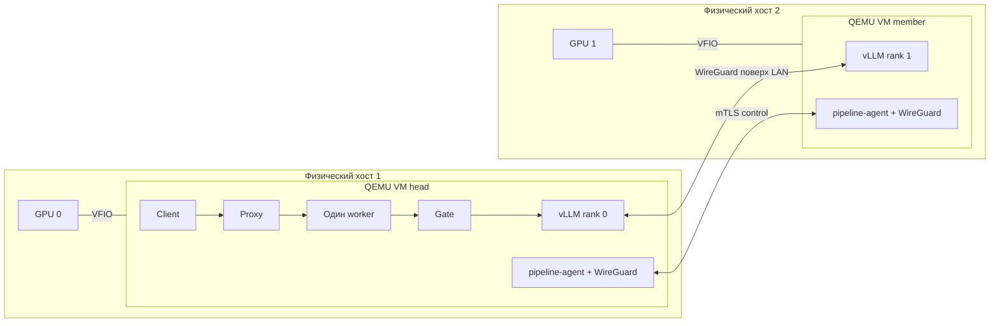

# Две GPU VM через QEMU/KVM и VFIO

Это отдельный **dev-вариант**, в котором каждая физическая GPU передаётся своей
настоящей VM. Контейнеры pipeline работают внутри гостей. TDX, GPU CC и
аппаратная аттестация здесь не включаются. vLLM/Qwen3-14B проверены на двух
реальных VM: [результаты и границы прогона](VM-REPORT.md).

## Размещение на текущем стенде

| Ресурс | Head | Member |
|---|---|---|
| Физический хост | hetzner-cuda-01 | hetzner-cuda-02 |
| LAN хоста | 192.168.100.2 | 192.168.100.3 |
| VM | cocoon-pipeline-vm-head | cocoon-pipeline-vm-member |
| LAN VM (`lan0`) | 192.168.100.22 | 192.168.100.23 |
| IP контейнера rank | 192.168.100.32 | 192.168.100.33 |
| Engine WireGuard | 10.231.0.1 | 10.231.0.2 |
| GPU BDF хоста | 0000:01:00.0 | 0000:01:00.0 |
| GPU BDF гостя | 0000:09:00.0 | 0000:09:00.0 |

Оба PCI function GPU (graphics и audio) из одной IOMMU group назначаются одной
VM с `managed=yes`. libvirt отключает хостовые драйверы при старте и возвращает
их после остановки. Launcher проверяет привязку к `vfio-pci`, затем восстановление
исходных драйверов и ранее работавшего `nvidia-persistenced`.



Client/proxy/key-manager/worker находятся в контейнере head для локального
fake-TON demo. Agent управляет группой, а **VM создаёт libvirt по командам
`vm.py`**. VM и контейнер имеют отдельные жизненные циклы.

## 1. Подготовить хосты и VM

Все команды ниже выполняются из корня checkout на управляющем Mac. `vm.py`
использует SSH endpoints и ключ из `experiments/gpu-pipeline/lab.json`. Это
конфигурация указанного двухмашинного стенда; перед использованием другого стенда
нужно проверить конфигурации, свободные IP, PCI/IOMMU group, пути и ресурсы.

Требуются включённые KVM/IOMMU, ровно GPU + audio в выбранной IOMMU group,
активная существующая libvirt NAT network `default`, LAN MTU не меньше 1400,
32 GiB свободной RAM + 2 GiB резерва и 8 CPU на VM. Root disk — sparse 200 GiB.
Хостовый GPU до старта должен использовать NVIDIA driver. Завершите GPU
workloads и мониторы вроде `nvtop`: открытый device FD тоже мешает PCI detach.
Launcher сообщает PID и не убивает посторонние процессы автоматически.

```bash
python3 -B pipeline/deployment/vm.py init
python3 -B pipeline/deployment/vm.py prepare-host
python3 -B pipeline/deployment/vm.py prepare
python3 -B pipeline/deployment/vm.py start
python3 -B pipeline/deployment/vm.py wait
python3 -B pipeline/deployment/vm.py prepare-guest
python3 -B pipeline/deployment/vm.py stop
python3 -B pipeline/deployment/vm.py start
python3 -B pipeline/deployment/vm.py wait
```

До `prepare` подготовьте модели в `/home/ruslixag/cocoon-pipeline-dev/models`
на каждом хосте по [GPU-инструкции](../experiments/gpu-pipeline/README.md).
`prepare-host` устанавливает инструменты и проверяет подписанный pinned Ubuntu
cloud image; ядро/boot flags хоста не меняет и хост не перезагружает. Гостевой
драйвер и Container Toolkit устанавливаются через `prepare-guest`, поэтому после
него нужен показанный цикл остановки/старта VM.

Настройки, отдельный SSH-ключ гостей, known_hosts и локальные логи сохраняются в
`build/vfio-vm`; его нельзя публиковать. Для отдельных действий ставьте
`--rank 0` или `--rank 1` **перед** именем команды. SSH проходит через физический
хост в NAT management NIC гостя; SSH agent forwarding не используется.

## 2. Загрузить одинаковый runtime внутрь обеих VM

Соберите vLLM image командой из [DEPLOYMENT.md](DEPLOYMENT.md) и положите
`image.tar` и `artifact.json` на **каждый физический хост** в
`/home/ruslixag/cocoon-vm-artifacts/vllm/`. На обоих хостах должен быть один и тот
же архив; сравните SHA-256 через SSH. Контейнерный runtime физического хоста и
гостя имеют независимые image stores.

```bash
python3 -B pipeline/deployment/vm.py --rank 0 guest -- sudo docker load -i /srv/cocoon-artifacts/vllm/image.tar
python3 -B pipeline/deployment/vm.py --rank 1 guest -- sudo docker load -i /srv/cocoon-artifacts/vllm/image.tar
python3 -B pipeline/deployment/vm.py --rank 0 guest -- nvidia-smi
python3 -B pipeline/deployment/vm.py --rank 1 guest -- nvidia-smi
```

Модели и artifacts доступны гостю через read-only virtiofs. Это механизм
dev-подготовки, не confidential storage. Serving использует read-only model
mount и проверку manifest из существующего deployment.

## 3. Проверить или запустить demo

Приёмка выполняет запросы и проверки отказа/повторного запуска, затем
**останавливает контейнеры**, оставляя VM для чтения диагностики:

```bash
python3 -B test/test-pipeline-vm-gpu.py \
  --backend vllm --model large \
  --remote-dir /home/cocoon/cocoon-vm-test \
  --artifact-dir /srv/cocoon-artifacts/vllm \
  --output build/vfio-vm/acceptance-vllm
```

Выходной каталог должен быть новым. Проверка использует те же scenario functions,
что bare-metal GPU suite, но SSH/SCP направлены внутрь VM; дополнительно проверяет
KVM, host VFIO binding и guest identity. Все четыре demo IP должны быть свободны.

Для ручного demo сохраните `artifact.json` первого хоста локально и сгенерируйте
новые bundles. Проверьте guest BDF в `example-vm.json` по `nvidia-smi`:

```bash
scp -i ~/.ssh/ms ruslixag@144.76.224.249:/home/ruslixag/cocoon-vm-artifacts/vllm/artifact.json build/vfio-vm/artifact.json
python3 -B pipeline/deployment/bundle.py \
  --config pipeline/deployment/example-vm.json \
  --artifact build/vfio-vm/artifact.json --output build/vfio-vm/demo-bundles
python3 -B pipeline/deployment/vm.py --rank 0 copy-to-guest build/vfio-vm/demo-bundles/head /home/cocoon/demo
python3 -B pipeline/deployment/vm.py --rank 1 copy-to-guest build/vfio-vm/demo-bundles/member /home/cocoon/demo
python3 -B pipeline/deployment/vm.py --rank 1 guest -- sudo /home/cocoon/demo/pipeline-deploy start
python3 -B pipeline/deployment/vm.py --rank 0 guest -- sudo /home/cocoon/demo/pipeline-deploy start
python3 -B pipeline/deployment/vm.py --rank 1 guest -- sudo /home/cocoon/demo/pipeline-deploy wait
python3 -B pipeline/deployment/vm.py --rank 0 guest -- sudo /home/cocoon/demo/pipeline-deploy wait
python3 -B pipeline/deployment/vm.py --rank 0 guest -- sudo /home/cocoon/demo/pipeline-deploy request --prompt 'Say hello.'
```

Для первого копирования `/home/cocoon/demo` должен отсутствовать: SCP создаст
его как каталог bundle. Для повторного копирования используйте source `head/.`
и `member/.` либо новый путь; не создавайте вложенный bundle случайно.

## Остановка и диагностика

```bash
python3 -B pipeline/deployment/vm.py --rank 0 guest -- sudo /home/cocoon/demo/pipeline-deploy stop
python3 -B pipeline/deployment/vm.py --rank 1 guest -- sudo /home/cocoon/demo/pipeline-deploy stop
python3 -B pipeline/deployment/vm.py stop
python3 -B pipeline/deployment/vm.py status
```

После `stop` обе VM выключены, GPU вновь принадлежат исходным хостовым драйверам.
Диски, libvirt definitions и диагностика сохраняются для повторного запуска;
существовавшие пользовательские GPU workloads автоматически не возобновляются.
VM launcher сначала просит штатное выключение и через 90 секунд может остановить
только свою VM принудительно. Вначале всегда останавливайте pipeline bundles.

На физическом хосте диагностика —
`/var/lib/cocoon-pipeline-vm/<имя-VM>/console.log` и `state.json`, журнал libvirt,
`virsh domstate <имя-VM> --reason`. Timeout SSH/virsh не означает, что libvirt
отменил передачу GPU: сначала проверьте фактическое состояние, затем `stop`.
Launcher сохраняет незавершённое владение до подтверждения восстановления.

## Что остаётся за скобками

- Здесь обычные VM, а не CVM: нет private memory, GPU CC, измеренного production
  image, реального verifier/аттестации или confidential цепочки доверия.
- Две VM и два rank, один запрос, BF16 Qwen3; это не multi-tenant provisioner,
  scheduler, HA, миграция или автоматическое размещение произвольного N.
- Cold-start проверка конкретного GPU/driver не квалифицирует все GPU resets,
  hotplug, OOM, аварии гипервизора или power loss. Host root остаётся доверенным.
- Base image закреплён, но гостевые APT-пакеты устанавливаются из актуального
  репозитория; их версии сохраняются. Reproducible measured guest image — отдельная
  задача production. SGLang в таком VM-размещении требует отдельного GPU-прогона.
- WireGuard/MTU connectivity и короткие функциональные запросы не заменяют
  длительную нагрузку и benchmark шага 13 или лимиты очередей шага 5.

Сохраняются открытые production-задачи P7-01/P7-03/P7-04 из плана. Для превращения
этого launcher в production provisioning нужен отдельный план: измеренный образ,
verifier, confidential storage, управление образами/ресурсами и fault qualification.
